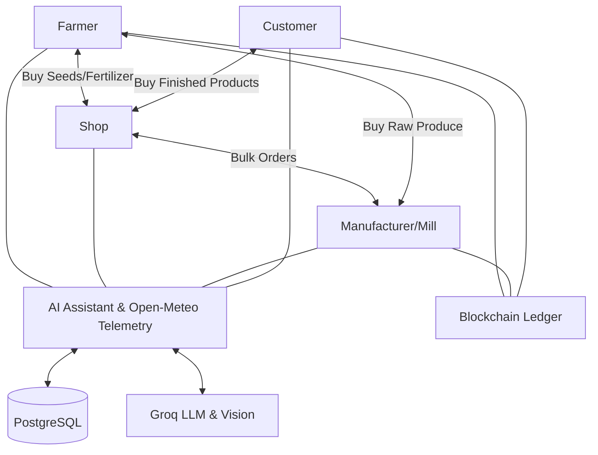

# AgriFlow AI: Project Implementation Detail & Roadmap

This document provides a deep dive into the technical implementation of AgriFlow AI, covering the architecture, security, role connectivity, and intelligent features.

---

## 🏗️ System Architecture & Connectivity

AgriFlow AI is built as a unified agricultural ecosystem where different roles interact to form a complete supply chain.

### Role Interaction Map

---

## 🔐 Identity & Access Management

AgriFlow AI provides a flexible and secure authentication system designed to accommodate users who may play multiple roles within the agricultural ecosystem.

#### **A. Multi-Credential Authentication**
1. **Dual Login Methods**: Users can register and log in using either a verified **Email Address** or a **Phone Number**.
2. **OTP Verification**: Integrated **Phone OTP (SMS)** and **Email OTP** verification systems to ensure account security and owner validation.
3. **Encrypted Security**: Industry-standard **Password Hashing** (Bcrypt / Passlib) and **JWT (JSON Web Token)** based session management.
4. **Interactive Password Visibility**: Embedded show/hide toggle (`PasswordInput`) across all authentication, registration, and profile password forms.
5. **Zero-Scroll Single Page Flow**: Optimized layout with zero extra vertical scroll on standard mobile and desktop viewports.

#### **B. Multi-Role Account Logic (The "Same-Credential" Feature)**
1. **Credential Versatility**: A single individual can maintain multiple professional profiles (e.g., a **Farmer** who also owns a **Fertilizer Shop**) using the same Email or Phone Number.
2. **Role Isolation**: The system treats each `(Credential + Role)` pair as a distinct account. This ensures that:
    - Farm records and business inventories remain strictly separated.
    - Role-specific dashboards and analytics do not overlap.
    - Users can switch between their professional roles by simply logging in with the desired role selected.

---

## 👥 Role-Based Feature Breakdown

### 🚜 1. Farmer Role (Detailed Journey)

The farmer's experience is designed to be a complete farm management system, organized into a logical daily workflow.

#### **A. Central Dashboard (The Control Center)**
1. **Identity & Land Record**:
    - **Personal Details**: Name, Farmer ID, Father/Husband name, and contact info.,bank details
    - **Land Portfolio**: Save detailed land records including Khasra/Serial numbers and area in **Acres.Guntas** (Base-40 logic).
2. **Work Calendar**:
    - **Activity Scheduler**: Notes for future work (Sowing, Fertilizing, Spraying).
    - **Countdown Reminders**: "Days Left" indicators for critical tasks like upcoming harvests.
3. **Quick Insights Section**:
    - **Active Crops Feed**: Real-time list of only currently growing crops.
    - **Filtered Market Prices**: Live prices shown *specifically* for the crops the farmer is currently growing.
    - **Instant Weather & Soil**: Current conditions and root moisture at the farm's GPS location.
    - **Agri-News Summary**: Curated headlines relevant to the farmer's region and crops.

#### **B. Crop Management Page (Detailed Field Logs)**
1. **Input & Expense Logging**:
    - **Financial Tracking**: Detailed breakdown of costs (Seeds, Fertilizers, Pesticides).
    - **Labour Tracking**: Log costs based on the number of persons and duration of work.
    - **Machinery & Irrigation**: Log tractor hours, electricity, and water costs.
2. **Operations Log**:
    - **Inputs Used**: Record exactly which brands and quantities of fertilizers/pesticides were applied.
    - **Activity Tracking**: Note every stage from Sowing to Weeding.
3. **Harvesting & Sales**:
    - **Harvest Records**: Note harvest quantities in Bags/Quintals with quality grading (Grade A, B, etc.).
    - **Direct Sales**: Integrated flow to sell the harvest to **Mandis, Mills, or Direct to Customers**.
    - **Traceability QR**: Generate a unique QR code for each harvest batch to prove origin and quality.

#### **C. Fertilizer & Input Marketplace (Smart Procurement)**
1. **GPS-Fenced Browsing**: 
    - Browse **Fertilizers, Pesticides, Seeds, and Machinery**.
    - **50km Range Restriction**: Only shows shops and products available within a 50km radius of the farmer's GPS location.
2. **Order Workflow**:
    - **Shopping Cart**: Add multiple inputs from different nearby shops.
    - **Payment Options**: Support for both **Online (Razorpay Demo)** and **Cash on Delivery**.
    - **Verification**: Orders are sent as "Requests" to shop owners, who must accept them before fulfillment.

#### **D. Market & Intelligence Hub**
1. **Comprehensive Market Page**: View live market prices for *all* agricultural commodities within a specific geographic range.
2. **Advanced Weather & Soil Moisture Intelligence (Open-Meteo Integration)**:
    - **Multi-Depth Soil Moisture Monitoring**: Live volumetric telemetry across 5 root depth layers (0–1cm surface topsoil, 1–3cm shallow seedling roots, 3–9cm active crop feeding zone, 9–27cm deep taproot zone, and 27–81cm deep subsoil reserve).
    - **Automatic Geolocation**: Detects farm GPS location with fallback to registered village/district profile geocoding.
    - **7-Day Agricultural Forecast**: Daily high/low temperatures, precipitation volume (mm), weather condition indicators, and soil moisture predictions.
    - **Atmospheric Conditions**: Real-time relative humidity, 10m wind speed, and reference crop evapotranspiration (ET₀ mm).
    - **Smart Farmer Advisory Engine**: Automated action recommendations for irrigation planning, heatwave protection, frost defense, fungal risk prevention, and spray suitability.
    - **Historical ERA5-Land Archive**: Retrospective climate research querying past satellite reanalysis datasets.
3. **Dedicated News Page**: Full-screen experience for in-depth agricultural news, policy updates, and government schemes.

---

### 🏪 2. Shop Role (Retail & Logistics)

The shop owner's journey is a comprehensive retail and financial management system.

#### **A. Central Dashboard (The Nerve Center)**
1. **Real-time Metrics**: View Total Revenue (Monthly), Active Inventory, Low Stock Alerts, and Pending Orders.
2. **Sales Trends**: Interactive charts showing order volume trends over various periods (7D, 1M, 3M, 1Y).
3. **Financial Pulse**: Quick view of monthly expenses and net profit calculations.
4. **Recent Activity**: Live feed of recent orders with status and payment tracking.

#### **B. Inventory & Batch Management**
1. **Product Grouping**: Similar products are stocked and displayed together for easier management.
2. **Batch-Wise Tracking**: 
    - **Add New Product**: Create new product listings with categories, brands, and initial stock.
    - **Add Batch**: Easily add new batches to existing products, maintaining separate cost prices, manufacture dates, and batch numbers.
3. **Workflow Control**:
    - **Draft vs. Active**: New products/batches start as drafts.
    - **Activation Pipeline**: Once expenses are allocated and prices set, products are marked "Active" to become visible to farmers in the 50km range.
4. **Quick Sell Interface**: Side-panel cart for rapid walk-in sales with discount and payment mode support.

#### **C. Accounting & Expense Logging**
1. **Expense Categorization**: Log expenses across various categories:
    - **Fixed Costs**: Rent, Regular Wages, Utilities.
    - **Variable Costs**: Batch Transport, Batch Unloading Labour, Batch Other Costs.
2. **Smart Cost Allocation**: 
    - Batch-specific expenses (transport/labour) can be linked to multiple draft batches.
    - **Weighted Distribution**: Costs are automatically distributed across batches based on their purchase value (Cost × Quantity).
3. **Financial Transparency**: Comprehensive expense table showing the history of all business costs with date and linked batch details.

#### **D. Order Management**
1. **Pipeline Tracking**: Manage orders through a full lifecycle: Pending → Confirmed → Dispatched → Completed (or Cancelled).
2. **Payment Verification**:
    - **Razorpay Integration**: Automated payment status for online orders.
    - **Cash Flow**: "Receive Payment" workflow for COD orders.
3. **Profit Analysis**: Every order shows a detailed breakdown of Revenue vs. Product Cost vs. Net Profit.

#### **E. Sales Analytics & Ledger**
1. **Category Performance**: Visual breakdown of revenue and profit across Seeds, Fertilizers, Pesticides, and Machinery.
2. **Product Ledger**: Batch-wise sales ledger showing exactly how much of each batch was sold, at what cost, and the resulting profit margins.
3. **Health Metrics**: Channel breakdown (Cash vs. Online) and order fulfillment health percentages.

#### **F. Settings & Profile**
1. **Professional Identity**: Manage shop name, owner details, license numbers, and profile pictures.
2. **Detailed Mapping**: Save both Shop and Permanent addresses with full field support (House No, Mandal, etc.).
3. **Payout Settings**: Manage Bank details, UPI IDs, and Beneficiary names for settlements.
4. **Security**: Dedicated password management and notification preference controls.

---

### 🏭 3. Manufacturer / Mill Role (Industrial Production)

The Manufacturer role is designed for industrial processing units (e.g., Rice Mills, Flour Mills, Oil Extraction) that bridge the gap between raw harvest and retail-ready branded products.

#### **A. Dashboard & KPIs**
1. **Industrial Health**: Month-wise Revenue, Purchase Costs, Processing Expenses, and Net Profit.
2. **Operations Pipeline**: Quick stats on Pending Inward Harvests, Active Milling Runs, and Packaged Stocks.

#### **B. Raw Harvest Procurement**
1. **Intake Logging**: Record incoming raw produce directly from farmers or market mandis with moisture levels, grading, and weighbridge slips.
2. **Direct Farmer Payouts**: Record settlement transactions, payment modes, and invoice receipts.

#### **C. Processing & Milling Engine**
1. **Conversion Runs**: Transform raw intake (e.g. Paddy) into finished products (e.g. Premium Basmati Rice, Broken Rice, Husk/Bran).
2. **Wastage & Recovery Analytics**: Automatic computation of recovery efficiency percentage and byproduct yield.
3. **Cost Factor Allocation**: Apportion electricity, machine depreciation, labor, and packaging to compute per-unit production cost.

#### **D. Wholesale Sales & Orders**
1. **B2B Fulfillment**: Sell branded products to retail shops or large distributors.
2. **Order Pipeline**: Advance orders from "Pending" to "Dispatched" and "Delivered" with live status tracking.
3. **Financial Summary**: Detailed revenue breakdown for every sale, including discounts and net margins.

#### **E. Mill Accounting & Analytics**
1. **P&L Ledger**: Comprehensive Profit & Loss analysis over custom periods (7d, 30d, 90d, 1y).
2. **Expense Management**: Log industrial overheads (Labour Wages, Electricity/Power, Maintenance, Packaging).
3. **Procurement Analytics**: Visual breakdown of top crops bought and average purchase prices.
4. **Sales Performance**: Ranking of top-performing finished products by revenue and volume.

#### **F. Settings & Security**
1. **Industrial Profile**: Manage mill name, owner details, license numbers, and location.
2. **Payout Settings**: Manage Bank and UPI details for receiving wholesale payments.
3. **Security**: Professional password management and notification preference controls.

---

### 🛍️ 4. Customer Role (End Consumer)

The Customer role focuses on providing a transparent, farm-to-table shopping experience with a focus on quality, origin, and convenience.

#### **A. Smart Marketplace**
1. **Discovery**: Browse a curated list of fresh crops directly from farmers and processed goods from mills.
2. **Intelligent Search**: Find products by name, brand, or category (Seeds, Grains, Organic, etc.).
3. **Low Stock Awareness**: Visual badges indicating when a product is running low to encourage timely purchases.

#### **B. Journey Traceability**
1. **Farm-of-Origin**: View exactly which farmer grew the produce and their location.
2. **Industrial Transparency**: For processed goods, see processing batch details and manufacturing dates.
3. **Timeline Visualization**: An interactive "Journey Traceability" timeline that tracks the product from the Farm → Processing → Marketplace.

#### **C. Cart & Secure Checkout**
1. **Persistent Cart**: Manage items across sessions, with easy removal and total amount calculation.
2. **Razorpay Integration**: Professional checkout experience with support for UPI, Cards, and Netbanking (Demo/Test mode).
3. **Order Confirmation**: Real-time status updates from "Pending" to "Confirmed" once payment is verified.

#### **D. Order Management**
1. **Order History**: A complete accordion-style view of all past orders with status badges.
2. **Itemized Receipts**: View specific items, quantities, and prices for every historical transaction.
3. **Local Focus**: Dashboard highlights for "Trending Near You" to promote local agricultural consumption.

#### **E. Profile & Preferences**
1. **Address Management**: Save delivery locations for faster checkout.
2. **Personalization**: Dashboard greetings and personalized recommendations based on featured categories.

---

## 🤖 Intelligent AI Assistant (RAG)

The Agri Assistant is a role-aware AI companion that provides hyper-localized advice and business intelligence.

#### **A. Hybrid Intelligence Engine**
| Mode | Source | Logic | UI Indicator |
| :--- | :--- | :--- | :--- |
| **Direct Retrieval (DB Only)** | Local Database | For sensitive data (Bank, IFSC). Stays on-server. | 🟢 Green |
| **AI General (External)** | Groq LLM | For general advice (Best practices, pest info). | 🟣 Purple |
| **Intelligent Combo (Mixed)** | DB + AI | Anonymized analysis of personal data (Profits, Trends). | 🔵 Blue |

#### **B. Conversational Features**
1. **Multi-Session History**: Start a **New Chat** for fresh topics while keeping old conversations accessible in the sidebar.
2. **Session Refresh**: Instantly reset the current conversation with one tap for a clean slate.
3. **Secure Deletion**: Full control over chat history with the ability to delete individual sessions permanently.
4. **Auto-Titling**: AI-driven session naming based on the first question asked for easy search later.
5. **Quick Actions**: Role-specific "Quick Questions" for common tasks (e.g., "Show my harvest" for Farmers, "Check revenue" for Shops).

#### **C. Role-Based Privacy & Isolation**
1. **Isolated Experiences**: Each role (Farmer, Shop owner, Manufacturer, Customer) has a completely separate assistant instance.
2. **Zero Leakage**: Chat history for a Shop owner is never visible to a Farmer or Customer, even on the same device.
3. **Tailored Personality**: The AI adapts its tone and knowledge base specifically to the user's role (e.g., Mill Assistant vs. Farm Assistant).

---

## 📍 Infrastructure & Aesthetics

1. **Payment Gateway**: Integrated **Razorpay (Demo Mode)** for secure transactional simulations.
2. **Location Intelligence**: Multi-provider geo-services using **OpenCage, Nominatim, and Overpass APIs** for 50km range discovery.
3. **Design Language**: Premium **Glassmorphism** interface with dynamic **Light/Dark mode** synchronization.
4. **Real-time AI**: Near-zero latency responses powered by **Groq LPU Inference**.
5. **Business Intelligence**: Interactive data storytelling and financial trends using **Recharts**.
6. **Security Architecture**: Protected **JWT-based session management** with role-specific access controls.
7. **Asset Management**: Integrated **Media Upload System** for profile logos and product documentation.
8. **Geofencing**: Automated **50km radius restriction** logic for local agricultural commerce.
9. **Meteorological Telemetry**: Direct integration with **Open-Meteo High-Resolution APIs** for 5-depth volumetric soil moisture and agricultural weather.

---

## 🔮 Future Scope & Roadmap

AgriFlow AI is committed to continuous evolution. Our roadmap focuses on community empowerment, precision agriculture, and cross-role intelligence.

#### **A. Advanced AI & Multilingual Support**
1. **AI Crop Health**: Deep-learning based **disease diagnosis** via mobile photos, providing instant treatment and pesticide recommendations *(Implemented with Groq Llama 3.2 Vision)*.
2. **Multilingual Expansion**: Native support for **Regional Indian Languages** (Hindi, Telugu, Tamil, Kannada, Marathi, Gujarati, Punjabi, Bengali) *(Implemented across full UI)*.
3. **Voice Interface**: Voice-to-action features for farmers to log expenses or check prices without typing *(Implemented with real-time audio wave feedback)*.

#### **B. Farmer-to-Farmer Community Hub**
1. **P2P & Group Chat**: A dedicated community section for farmers to form local groups or communicate individually.
2. **Rich Media Sharing**: Seamlessly share **voice notes, farm images, field videos, and PDF documents** for knowledge sharing.
3. **Expert Q&A**: Verified agricultural experts can join groups to provide real-time guidance.

#### **C. Smart Recommendation Systems (Role-Specific)**
1. **For Farmers**: 
    - **Precision Nutrition**: Fertilizer advice based on **Soil Testing Reports**, current crop type, and historical yield data *(Implemented in Plot Nutrition module)*.
    - **Agri-YouTube Integration**: Curated video guides on "Smart Farming," new crop techniques, and modern machinery *(Implemented in Learning Hub)*.
2. **For Shops**: 
    - **Predictive Stocking**: Recommendations on which fertilizers/seeds to stock based on **historical regional demand** and current crop cycles.
    - **New Product Alerts**: Discover new varieties of high-yield seeds and advanced pesticides through a wholesale discovery engine.
3. **For Manufacturers/Mills**: 
    - **Procurement Intelligence**: Strategic "When to Buy" advice based on regional harvest forecasts to ensure optimal raw material pricing.
    - **Inventory Optimization**: Recommendations on finished goods production levels based on wholesale demand trends.
4. **For Customers**: 
    - **Smart Buying**: Price-trend analysis to advise customers on the **best time to buy** specific commodities to get the lowest price.

#### **D. Emerging Technologies**
1. **Blockchain Ledger**: Immutable end-to-end traceability for **Organic Certification** and fair-trade verification *(Implemented with SHA-256 Hash Chaining & PoW explorer)*.
2. **IoT Integration**: Direct data fetching from soil moisture sensors and farm weather stations for real-time dashboard updates *(Implemented with Open-Meteo multi-depth telemetry)*.

#### **E. Frontend Enhancements**
1. **Persistent Role Selection**: Provide an option to "Remember Role" during the first login. If selected, bypass the role selection screen on future logins. If "Do not remember" is chosen, the role selection screen will always be shown when the user tries to log in.