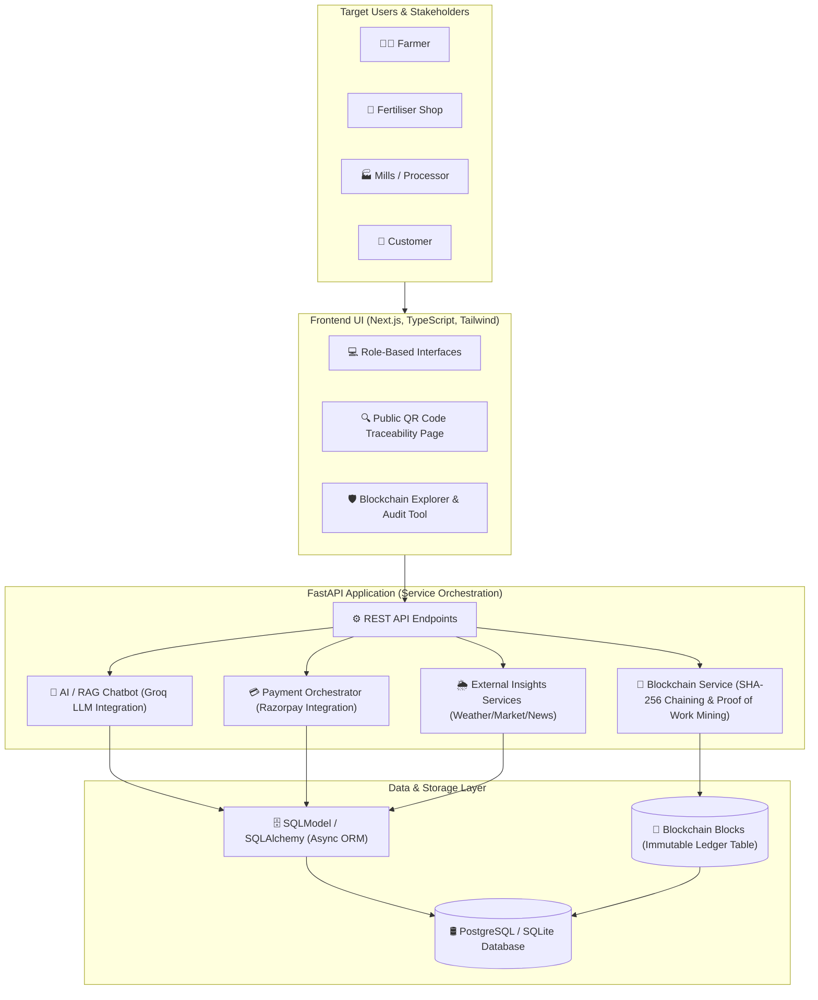

# AgriFlow AI

AgriFlow AI is a full-stack web application for agriculture supply-chain and farm operations. It provides role-based modules (farmer, manufacturer, customer/shop) for managing crops, products, orders, analytics, and AI-assisted workflows (RAG chatbot), with optional integrations for payments and external data sources (weather/market/news).

### Features

- **Role-based access for real users**
  - Separate experiences for farmer, fertiliser shop, mills, and customers.
- **Farm operations management**
  - Manage crop records, activities, and status updates during the season.
- **Product and order lifecycle**
  - Create products, place orders, and track order status changes.
- **Real-time style dashboards**
  - Analytics endpoints used to power dashboards for day-to-day decisions.
- **Shop accounting support**
  - Track expenses and basic shop accounting entries.
- **Payments (real-world checkout)**
  - Razorpay-based payments integration.
- **AI assistant (RAG chatbot)**
  - Ask questions and get guided help using application knowledge.
- **Live external insights**
  - Weather, market prices, and agriculture news endpoints for operational awareness.
- **Immutable Blockchain Ledger**
  - Cryptographically secured supply chain traceability using SHA-256 hash chaining and proof-of-work mining to guarantee organic certifications and fair-trade verifications.

## Architecture




## Tech Stack

### Frontend

- Next.js (`next`)
- React
- TypeScript
- TailwindCSS
- Axios
- Zod
- Radix UI primitives

### Backend

- FastAPI
- Uvicorn
- SQLModel
- SQLAlchemy (async)
- Alembic
- JWT/Auth libs: `python-jose`, `pyjwt`, `passlib`
- Async DB drivers: `aiosqlite`, `asyncpg`
- Integrations: Razorpay
- Env management: `python-dotenv`, `pydantic-settings`
- AI: Groq SDK

### Database

- PostgreSQL

## Local Setup

### Prerequisites
- Node.js 18+ and npm
- Python 3.10+
- PostgreSQL database

### Backend Setup

1. Navigate to the backend directory:
   ```bash
   cd backend
   ```
2. Create and activate a virtual environment:
   ```bash
   python -m venv venv
   # On Windows
   venv\Scripts\activate
   # On macOS/Linux
   source venv/bin/activate
   ```
3. Install dependencies:
   ```bash
   pip install -r requirements.txt
   ```
4. Set up environment variables:
   Copy `.env.example` to `.env` and fill in the required values, especially `DATABASE_URL`.
   ```bash
   cp .env.example .env
   ```
5. Initialize the database and run seeds (optional but recommended):
   ```bash
   python force_init_db.py
   python seed_data.py
   ```
6. Start the FastAPI server:
   ```bash
   uvicorn app.main:app --reload
   ```

### Frontend Setup

1. Navigate to the frontend directory:
   ```bash
   cd frontend
   ```
2. Install dependencies:
   ```bash
   npm install
   ```
3. Start the Next.js development server:
   ```bash
   npm run dev
   ```

The application should now be running at `http://localhost:3000` (frontend) and `http://localhost:8000` (backend API).

## Deployment

See [DEPLOYMENT.md](./DEPLOYMENT.md) for detailed deployment instructions.

## Future Scope

- **Real-time market + weather intelligence**
  - Continuous updates and alerts for price changes, rainfall forecasts, and extreme weather.
- **Multiple API integrations**
  - Connect more sources (government advisories, mandi prices by region, satellite/weather providers).
- **AI crop health detection**
  - Upload field images to detect diseases, nutrient deficiency, and pest risk.
- **AI recommendations**
  - Personalized crop planning, fertilizer/pesticide guidance, and irrigation scheduling.
- **Smart notifications for farmers and shops**
  - Real-time order/payment updates, reminders, and actionable farm alerts.
- **Predictive analytics**
  - Yield prediction, demand forecasting, and price trend prediction.
