# AgriFlow System Architecture & Data Flow Specification

This document details the complete end-to-end architecture of **AgriFlow**, breaking down each feature, subsystem, backend router, database model, and external integration with clean box-and-arrow diagrams.

---

## 1. Global High-Level System Architecture

```mermaid
graph TD
    subgraph ClientTier ["Frontend Client Tier (Next.js 16 + React + TailwindCSS)"]
        UI_Farmer["Farmer Dashboard"]
        UI_Shop["Input Shop Dashboard"]
        UI_Mill["Manufacturer Dashboard"]
        UI_Customer["Customer Marketplace"]
        UI_Trace["Public QR Traceability"]
        UI_Auth["Auth & Onboarding Portal"]
        UI_Docs["Developer Documentation"]
    end

    subgraph APIGateway ["API Layer (FastAPI Asynchronous Gateway)"]
        Router_Auth["Auth Router (/api/auth)"]
        Router_Crops["Crops & Farmer Router (/api/crops)"]
        Router_Nutrition["Soil Nutrition Router (/api/nutrition)"]
        Router_Weather["Weather Router (/api/weather)"]
        Router_Chat["AI Chat & Voice Router (/api/chat)"]
        Router_CropHealth["Crop Health Router (/api/crop-health)"]
        Router_Blockchain["Blockchain Router (/api/blockchain)"]
        Router_Orders["Orders & Payments Router (/api/orders)"]
        Router_Shop["Shop Accounting Router (/api/shop-accounting)"]
        Router_News["News & Prices Router (/api/news)"]
        Router_Learning["Learning Router (/api/learning)"]
        Router_Translate["Translation Router (/api/translate)"]
    end

    subgraph DataStorage ["Data & Persistence Layer"]
        PG_DB[("PostgreSQL Database\n(via asyncpg & SQLModel)")]
        Local_FS[("Persistent File System\n(/uploads leaf & cert photos)")]
    end

    subgraph ExternalServices ["External Third-Party APIs"]
        Ext_Brevo["Brevo HTTP API\n(Email OTP over Port 443)"]
        Ext_Fast2SMS["Fast2SMS API\n(SMS OTP for +91 numbers)"]
        Ext_Groq["Groq Cloud\n(Llama 3.3 LLM Inference)"]
        Ext_Weather["OpenWeatherMap API\n(Live 5-Day Weather)"]
        Ext_OpenCage["OpenCage Geocoder\n(GPS to Location Name)"]
        Ext_News["NewsAPI\n(Agri News & Mandi Prices)"]
        Ext_Razorpay["Razorpay\n(Payments & Checkout)"]
        Ext_YouTube["YouTube Data API v3\n(Farming Video Feed)"]
        Ext_HF["Hugging Face API\n(Crop Disease Vision Model)"]
    end

    UI_Farmer --> APIGateway
    UI_Shop --> APIGateway
    UI_Mill --> APIGateway
    UI_Customer --> APIGateway
    UI_Trace --> APIGateway
    UI_Auth --> APIGateway

    APIGateway --> PG_DB
    APIGateway --> Local_FS

    Router_Auth --> Ext_Brevo
    Router_Auth --> Ext_Fast2SMS
    Router_Chat --> Ext_Groq
    Router_Weather --> Ext_Weather
    Router_Weather --> Ext_OpenCage
    Router_News --> Ext_News
    Router_Orders --> Ext_Razorpay
    Router_Learning --> Ext_YouTube
    Router_CropHealth --> Ext_HF
```

---

## 2. Authentication & Identity Management Architecture

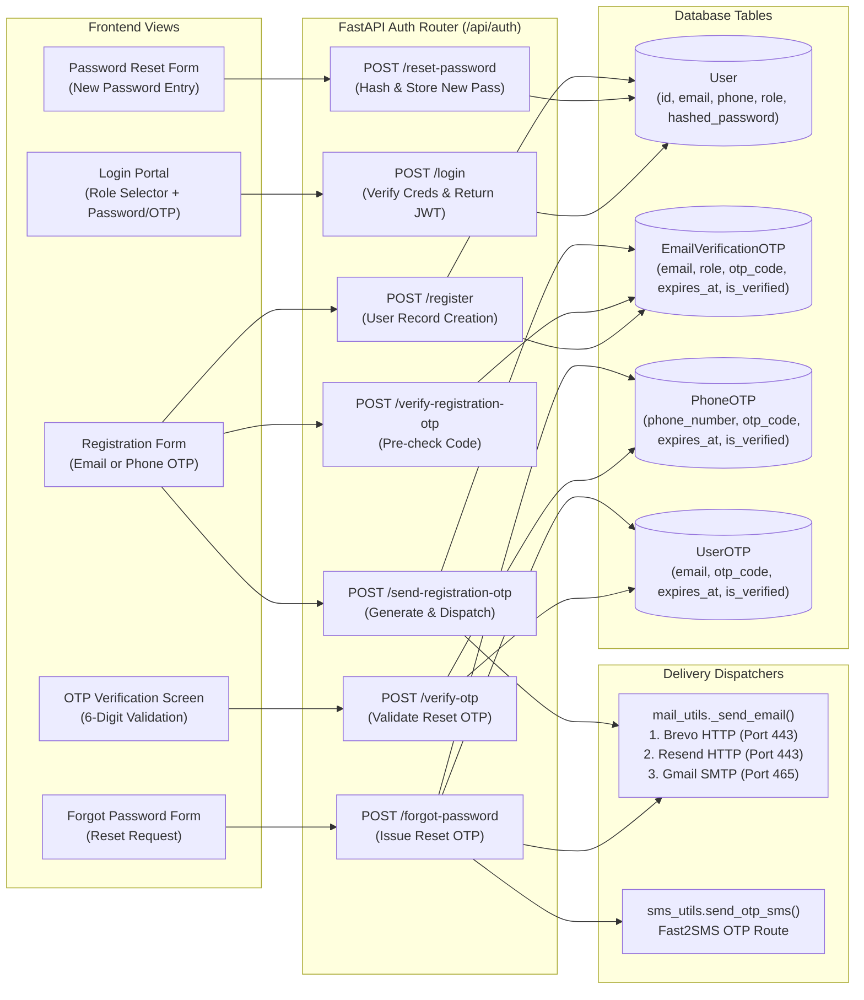

---

## 3. Blockchain Provenance & Product Traceability

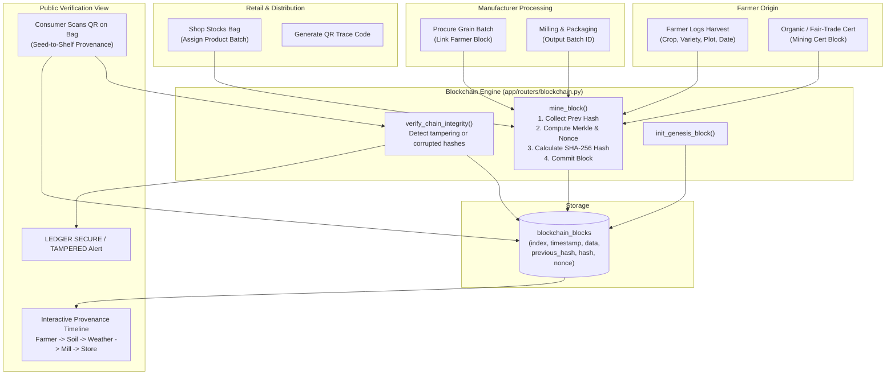

---

## 4. AI Crop Health & Leaf Disease Diagnosis

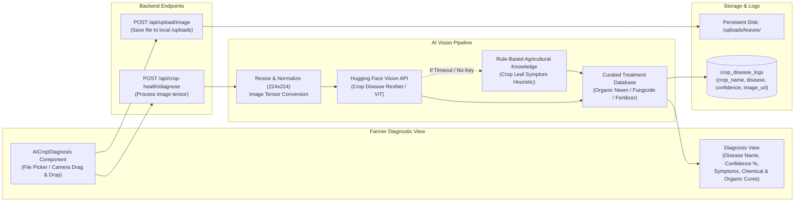

---

## 5. Conversational RAG AI Assistant & Voice Interface

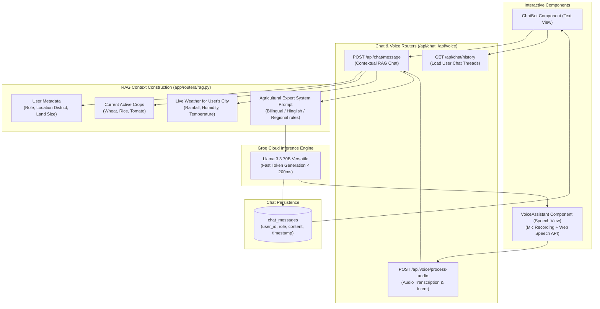

---

## 6. Real-Time Weather Forecast & Farming Micro-Advisory

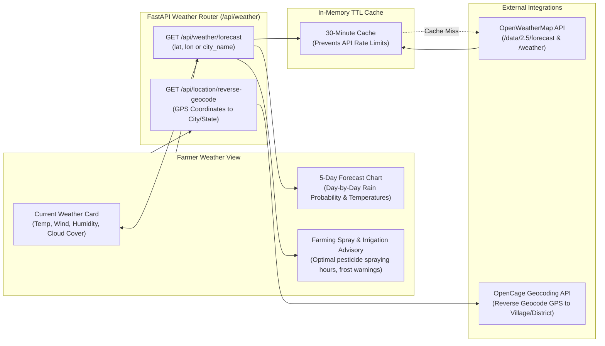

---

## 7. Soil Health, N-P-K Nutrition & Plot Management

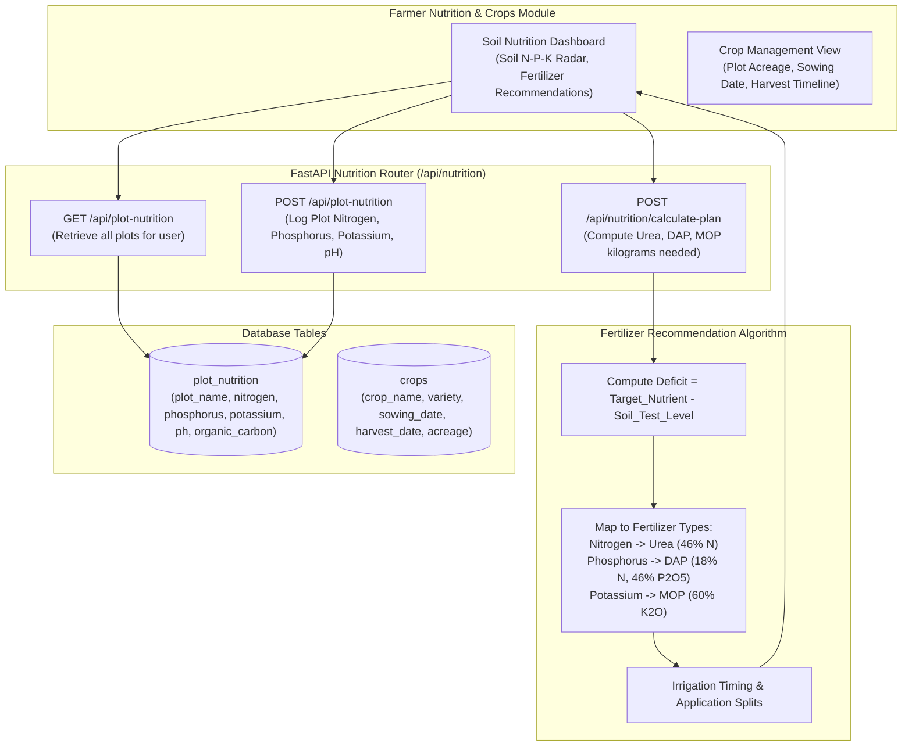

---

## 8. Learning Hub & Agricultural Video Tutorials

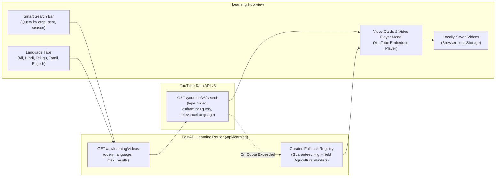

---

## 9. Input Retail Shop & Ledger Accounting

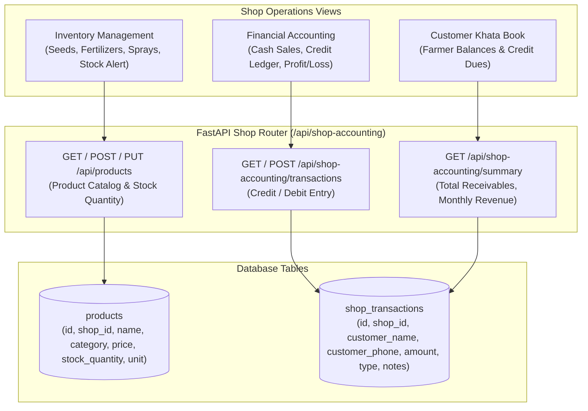

---

## 10. Manufacturer & Mill Processing Pipeline

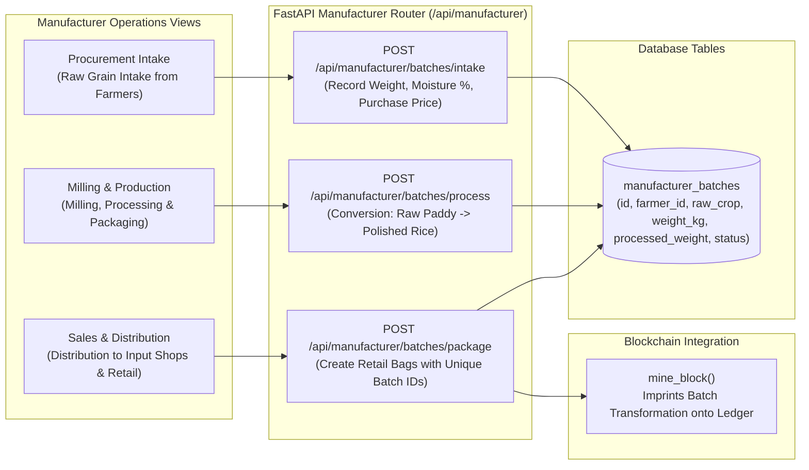

---

## 11. Customer Marketplace, Cart & Razorpay Payments

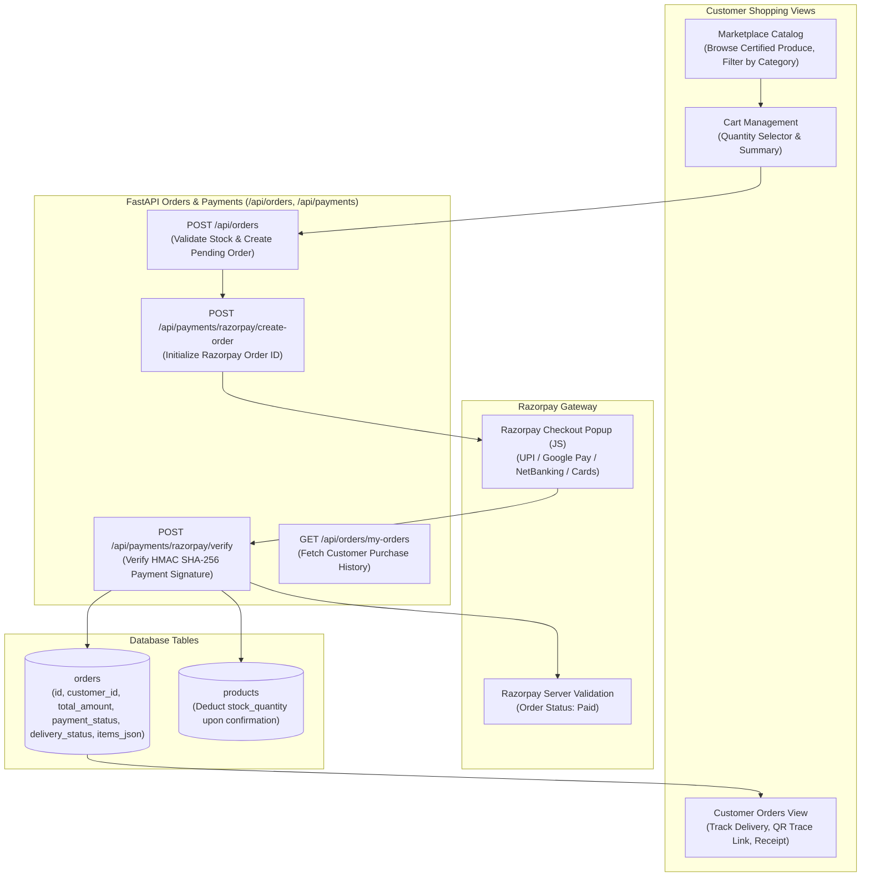

---

## 12. Multilingual Regional Translation Engine

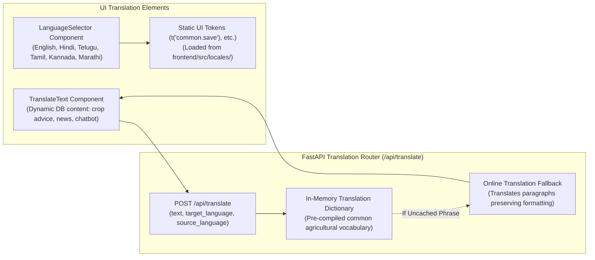
